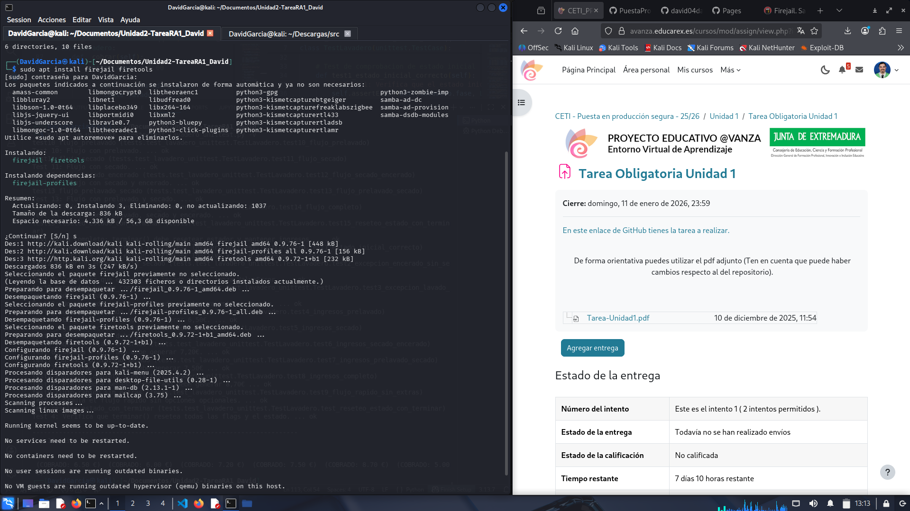
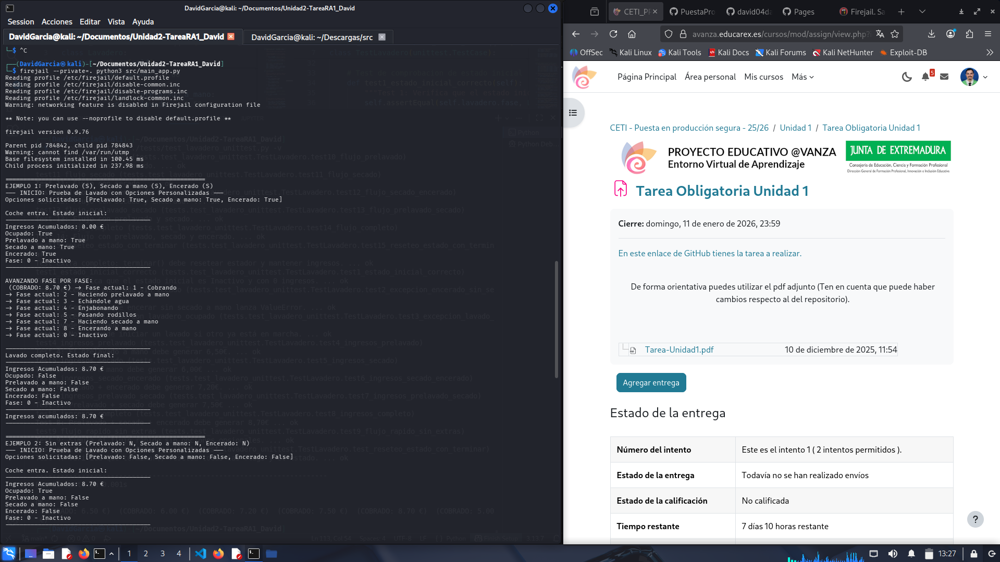

# Ejecución del programa en un entorno aislado (sandbox)
En este último paso se muestra como podemos ejecutar el programa de forma aislada dentro de la misma máquina en la que estamos trabajando, esto lo que hace es generar una especie de sistema aislado que no permite que niguna de las ejecuciones o interacciones realizadas en el sistema aislado `(Sandbox)` repercuta en la maquina real donde se está ejecutando

## Como ejecutar el programa en un sandbox
A continuación se muestra el proceso paso a paso: 

1. **Instalación de `FireJail` + `FireTools`:**

    Instalamos FireJail más la extensión de FireTools (Parte gráfica de FireJail) mediante el siguiente comando:

    ```console
    sudo apt install firejail firetools    
    ```

    

2. **Ejecución `Firetools`:**

    Una vez instalado, podemos comprobar que esta instalado correctamente mediante la ejecución en la terminal de:

    ```console
    firetools
    ```
    

    A través de esta interfaz gráfica podemos cualquier tipo de ajuste o configuración de forma grafica sobre FireJail

3. **Ejecución del programa (Lavadero) en `FireJail`:**

    Ahora vamos al punto más importante, ejecutaremos el programa *Lavadero* en Sandbox de FireJail mediante el siguiente comando:

    ```console
    firejail --private=. python3 src/main_app.py   
    ```

    Y podremos ver en la terminal los logs de la ejecución del programa:

    

4. **Ejecución de los test del programa (tests Lavadero) en `FireJail`:**

    Por último, se lanzan los test del programa *Lavadero* en SandBox de FireJail mediante el siguiente comando:

    ```console
    firejail --private=. env PYTHONPATH=src python3 -m unittest discover
     -v tests
    ``` 

    Y podremos ver en la terminal los logs de la ejecución de los test

    

[**Último paso (reflexión final)->**](./reflexion.md)