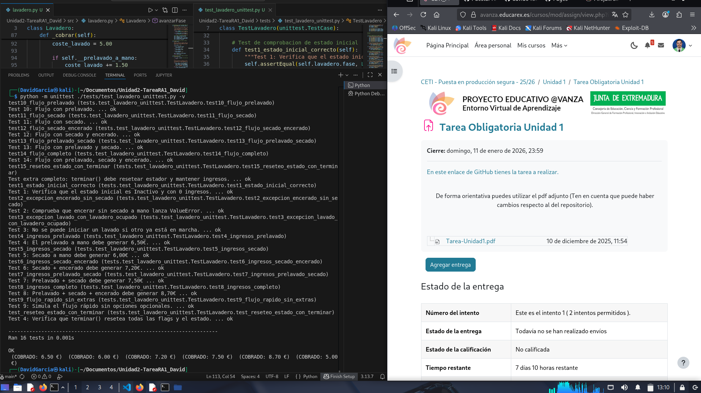

# Realización de tests unitarios del programa y resolución de errores

En este paso se procede a la realización de los tests unitarios del programa para comprobar el correcto funcionamiento en todas las casuisticas posibles del programa

## Test unitario
A continuación se muestra el archivo del test unitario resultante y los errores encontrados y solucionados gracias a estos:

**test_lavadero_unittest.py**
```python
# tests/test_lavadero_unittest.py

import unittest
# Importamos la clase Lavadero desde el módulo padre
from src.lavadero import Lavadero

class TestLavadero(unittest.TestCase):
    
    # Método que se ejecuta antes de cada test.
    # Es el equivalente del @pytest.fixture en este contexto.
    def setUp(self):
        """Prepara una nueva instancia de Lavadero antes de cada prueba."""
        self.lavadero = Lavadero()

    # ----------------------------------------------------------------------    
    # Función para resetear el estado cuanto terminamos una ejecución de lavado
    # ----------------------------------------------------------------------
    def test_reseteo_estado_con_terminar(self):
        """Test 4: Verifica que terminar() resetea todas las flags y el estado."""
        self.lavadero.hacerLavado(True, True, True)
        self.lavadero._cobrar()
        self.lavadero.terminar()
        
        self.assertEqual(self.lavadero.fase, Lavadero.FASE_INACTIVO)
        self.assertFalse(self.lavadero.ocupado)
        self.assertFalse(self.lavadero.prelavado_a_mano)
        self.assertTrue(self.lavadero.ingresos > 0) # Los ingresos deben mantenerse
        
    # ----------------------------------------------------------------------
    # TESTS  
    # ----------------------------------------------------------------------
        
    # Test de comprobacion de estado inicial
    def test1_estado_inicial_correcto(self):
        """Test 1: Verifica que el estado inicial es Inactivo y con 0 ingresos."""
        self.assertEqual(self.lavadero.fase, Lavadero.FASE_INACTIVO)
        self.assertEqual(self.lavadero.ingresos, 0.0)
        self.assertFalse(self.lavadero.ocupado)
        self.assertFalse(self.lavadero.prelavado_a_mano)
        self.assertFalse(self.lavadero.secado_a_mano)
        self.assertFalse(self.lavadero.encerado)
   
    def test2_excepcion_encerado_sin_secado(self):
        """Test 2: Comprueba que encerar sin secado a mano lanza ValueError."""
        with self.assertRaises(ValueError):
            self.lavadero.hacerLavado(False, False, True)

    def test3_excepcion_lavado_con_lavadero_ocupado(self):
        """Test 3: No se puede iniciar un lavado si otro ya está en marcha."""
        self.lavadero.hacerLavado(False, False, False)
        with self.assertRaises(ValueError):
            self.lavadero.hacerLavado(False, False, False)

    # Test de comprobacion de ingresos segun el tipo de lavado
    def test4_ingresos_prelavado(self):
        """Test 4: El prelavado a mano debe generar 6,50€."""
        self.lavadero.hacerLavado(True, False, False)
        self.lavadero._cobrar()
        self.assertEqual(self.lavadero.ingresos, 6.50)

    def test5_ingresos_secado(self):
        """Test 5: Secado a mano debe generar 6,00€"""
        self.lavadero.hacerLavado(False, True, False)
        self.lavadero._cobrar()
        self.assertEqual(self.lavadero.ingresos, 6.00)

    def test6_ingresos_secado_encerado(self):
        """Test 6: Secado + encerado debe generar 7,20€."""
        self.lavadero.hacerLavado(False, True, True)
        self.lavadero._cobrar()
        self.assertEqual(self.lavadero.ingresos, 7.20)
    
    def test7_ingresos_prelavado_secado(self):
        """Test 7: Prelavado + secado debe generar 7,50€"""
        self.lavadero.hacerLavado(True, True, False)
        self.lavadero._cobrar()
        self.assertEqual(self.lavadero.ingresos, 7.50)
    
    def test8_ingresos_completo(self):
        """Test 8: Prelavado + secado + encerado debe generar 8,70€"""
        self.lavadero.hacerLavado(True, True, True)
        self.lavadero._cobrar()
        self.assertEqual(self.lavadero.ingresos, 8.70)

    # ----------------------------------------------------------------------
    # Tests de flujo de fases
    # Utilizamos la función def ejecutar_y_obtener_fases(self, prelavado, secado, encerado)
    # Estos tests dan errores ya que en el código original hay errores en las las fases esperados, en los saltos.
    # ----------------------------------------------------------------------
    def test9_flujo_rapido_sin_extras(self):
        """Test 9: Simula el flujo rápido sin opciones opcionales."""
        fases_esperadas = [0, 1, 3, 4, 5, 6, 0]
         
        # Ejecutar el ciclo completo y obtener las fases
        fases_obtenidas = self.lavadero.ejecutar_y_obtener_fases(False, False, False)
        
        # Verificar que las fases obtenidas coinciden con las esperadas
        self.assertEqual( fases_obtenidas, fases_esperadas,
                        f"Secuencia de fases incorrecta.\nEsperadas: {fases_esperadas}\nObtenidas: {fases_obtenidas}")
      
    def test10_flujo_prelavado(self):
        """Test 10: Flujo con prelavado."""
        fases_esperadas = [0, 1, 2, 3, 4, 5, 6, 0]
        fases_obtenidas = self.lavadero.ejecutar_y_obtener_fases(True, False, False)
        self.assertEqual(fases_obtenidas, fases_esperadas)

    def test11_flujo_secado(self):
        """Test 11: Flujo con secado."""
        fases_esperadas = [0, 1, 3, 4, 5, 7, 0]
        fases_obtenidas = self.lavadero.ejecutar_y_obtener_fases(False, True, False)
        self.assertEqual(fases_obtenidas, fases_esperadas)

    def test12_flujo_secado_encerado(self):
        """Test 12: Flujo con secado y encerado."""
        fases_esperadas = [0, 1, 3, 4, 5, 7, 8, 0]
        fases_obtenidas = self.lavadero.ejecutar_y_obtener_fases(False, True, True)
        self.assertEqual(fases_obtenidas, fases_esperadas)

    def test13_flujo_prelavado_secado(self):
        """Test 13: Flujo con prelavado y secado."""
        fases_esperadas = [0, 1, 2, 3, 4, 5, 7, 0]
        fases_obtenidas = self.lavadero.ejecutar_y_obtener_fases(True, True, False)
        self.assertEqual(fases_obtenidas, fases_esperadas)

    def test14_flujo_completo(self):
        """Test 14: Flujo con prelavado, secado y encerado."""
        fases_esperadas = [0, 1, 2, 3, 4, 5, 7, 8, 0]
        fases_obtenidas = self.lavadero.ejecutar_y_obtener_fases(True, True, True)
        self.assertEqual(fases_obtenidas, fases_esperadas)

    # Test final completo
    def test15_reseteo_estado_con_terminar(self):
        """Test extra completo: terminar() debe resetear estador y mantener ingresos."""
        self.lavadero.hacerLavado(True, True, True)
        self.lavadero._cobrar()
        self.lavadero.terminar()

        self.assertEqual(self.lavadero.fase, Lavadero.FASE_INACTIVO)
        self.assertFalse(self.lavadero.ocupado)
        self.assertFalse(self.lavadero.prelavado_a_mano)
        self.assertTrue(self.lavadero.ingresos > 0)
 
# Bloque de ejecución para ejecutar los tests si el archivo es corrido directamente
if __name__ == '__main__':
    unittest.main()
```

*Código completo del archivo que contiene el test unitario en el que se testean todas las casuisticas posibles*

## Resolución de errores

Una vez que ejecutemos el test que se muestra anteriormente con el comando:
```console
python -m unittest ./tests/test_lavadero_unittest.py -v
```

Cuando lo ejecutamos, en este caso se presentaban errores en el codigo, por lo que en la terminal vamos encontrando todos los logs de cada uno de los test, tanto el que esta OK, como el que presenta un error, los que presentan error, además, añaden un trazo que nos ayuda a identificar el donde se encuentra exactamente el error.

**Errores solucionados en el programa mediante los tests:**

* **test_lavadero_unittest.py (Linea 20 y 46)**: Mediante los test se encuentra errores en las llamadas a la función `_hacer_lavado()` de `lavadero.py`, mientras que la llamada correcta a la función es `hacerLavado()`.

```python
    self.lavadero.hacerLavado(True, True, True)
```
*Linea 20*

```python
    self.lavadero.hacerLavado(False, False, True)
```
*Linea 46*

* **test_lavadero_unittest.py (Linea 98)**: En la llamada a la función `assertEqual()` falta el paso de los parametros `fases esperadas` y `fases obtenidas` para que la función pueda compararlos y comprobar que se obtiene el resultado esperado.

```python
    # Verificar que las fases obtenidas coinciden con las esperadas
        self.assertEqual( fases_obtenidas, fases_esperadas,
            f"Secuencia de fases incorrecta.\nEsperadas: {fases_esperadas}\nObtenidas: {fases_obtenidas}")
```
*Linea 98*

* **lavadero.py (Linea 145)**: Mediante los test, tras un fallo en el test nº12, la funcion `avanzarFase()` en `lavadero.py` presenta un error. Este es, que cuando entraba en la fase `secado a mano` directamente terminaba, mientras que lo que tenia que hacer es pasar a la fase de `encerado` siempre que estuviera marcado el encerado y sino, cuando pasara por esta fase terminar, mientras no.

```python
    elif self.__fase == self.FASE_SECADO_MANO:
        if self.__encerado:
            self.__fase = self.FASE_ENCERADO # Si está en la fase "secado a mano" y marcado "encerado" pasa a la fase "encerado", sino ejecuta la funcion terminar()
        else:
            self.terminar()
```
*Linea 145*

* **lavadero.py (Linea 98 y 101)**: Mediante los test, tras un fallo en el test nº5 se descubre que los valores que se sumen en la función `cobrar()` del coste de *secado a mano* estaba sumando **1,20€** en vez de **1,00€** y en el *encerado* **1,00€** en vez de **1,20€**.

```python
      if self.__secado_a_mano:
        coste_lavado += 1.00 
```
*Linea 98*

```python
    if self.__encerado:
        coste_lavado += 1.20 
```
*Linea 101*

* **lavadero.py (Linea 74)**: Mediante el test nº3 se descubre que la excepción arrojada por la función `hacerLavado()` en `lavadero.py` cuando se intenta realizar un lavado estando el lavadero **ocupado** es incorrecta, ya que está como `runTimeError` y debería ser `valueError`.

```python
 if self.__ocupado: # Si el lavadero está ocupado no se podra iniciar otro lavado diferente
    raise ValueError("No se puede iniciar un nuevo lavado mientras el lavadero está ocupado")
```
*Linea 74*

## Test completados
Finalmente, tras realizar los test y gracias a estos ir arreglando los fallos encontrados conseguimos un codigo muchos mas robusto, testeado y libre de errores. Una vez que todos los test que hemos programado hayan pasado satisfactoriamente debe aparecer la siguiente información en la terminal donde se ejecuten.



[**Siguiente paso (ejecución en SandBox)->**](ejecucionSandbox.md)